<!-- Draft. An AEP editor assigns the number. -->

## Abstract

Akash is a public compute marketplace: a deployer posts SDL, an order opens, providers bid, a lease runs on a cluster. This AEP leaves that market in place.

It specifies a **private bid path inside `provider-services`**. The order stays public. The bid is sealed; the public record stores a commitment, not a price. Allocate follows a match on that commitment. The lease credential is a derived bearer rather than the public tenant JWT. Close is two shielded spends whose signers include the provider.

Out-of-band bid and ask traffic MUST be fetchable by **private information retrieval (PIR)** so an untrusted **provider proxy** can serve the index without learning *which* bid or ask a renter or provider retrieved. That severs the association graph that a naive OOB channel would publish. The crate name `private-inference-rent` and env prefixes `PIR_*` are historical for the side-market gate. Cryptographic PIR is a **separate** dependency, designed after [Valar Group](https://github.com/valargroup) PIR (YPIR / SimplePIR as used in vote-nullifier and spendability retrieval).

The public path remains the default when the private path is off. Status: Draft. The behavior described here runs in the accompanying crate and provider build.

## Thesis

This AEP is biased on four points. They belong in the first page and in committee review.

| Bias | Claim |
|---|---|
| **Extend Akash market access** | Providers stay on the public Supercloud. The private path is more access, not a fork of the marketplace. |
| **AKT buy-and-hold** | A market bidder SHOULD prove, in zero knowledge, a **minimum AKT stake** before the sealed bid counts. Inclusion in a staking tree — not a public dump of the bonding account — creates buy-and-hold pressure on AKT. |
| **FROST as collaboration** | Threshold signers are a **cross-chain collaborative opportunity**. Penumbra-style validator sidecars are a welcome home for those shares. |
| **PIR for bids and asks** | Renters retrieve sealed bids (and providers retrieve asks) by **private information retrieval**. An untrusted third-party **provider proxy** MAY host the index. The proxy MUST NOT learn which row was fetched. |

If those fail, this is just another sealed-bid sidecar. The rest of the document is how to keep them.

Field tables: [`data-structures.md`](data-structures.md). Crate and Halo2 paths: [`crate-map.md`](crate-map.md). Cryptographic PIR (this thesis) is not the `PIR_*` env gate.

## How it bolts to Akash

A **deployer** writes **SDL**. That **deployment** opens an **order**. **Providers** **bid**. A **lease** places the workload. Hostname and inventory operators are unchanged.

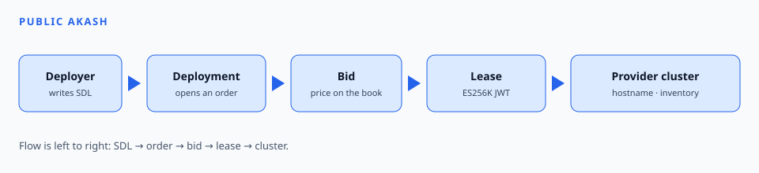

The private path is a second configuration of the same process. The order is shared. The bid, the lease credential, and settlement change.

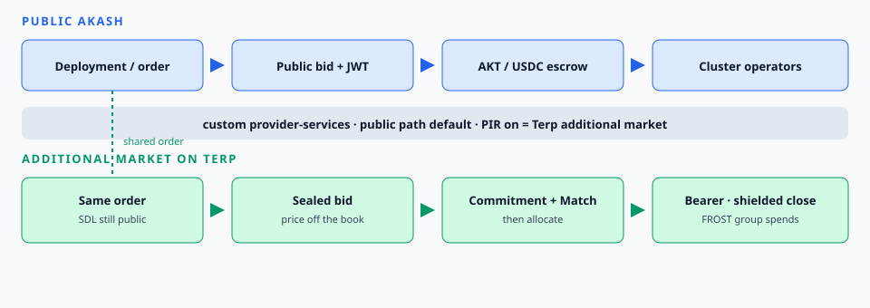

| Step | Public path | Private path |
|---|---|---|
| SDL / deployment | Unchanged | Same public order |
| Order | Unchanged | Same order, still readable |
| Bid | Price on the book (`MsgCreateBid`) | Sealed envelope. Hash on the record. |
| Allocate | Bid engine as today | After commitment `Match` |
| Lease credential | ES256K JWT | Derived access bearer |
| Pay / close | AKT / USDC escrow | Shielded two-spend close. CosmWasm records a grant only. |
| Process | `provider-services` | Same binary. Configuration selects the path. |

### What stays, what the private path adds

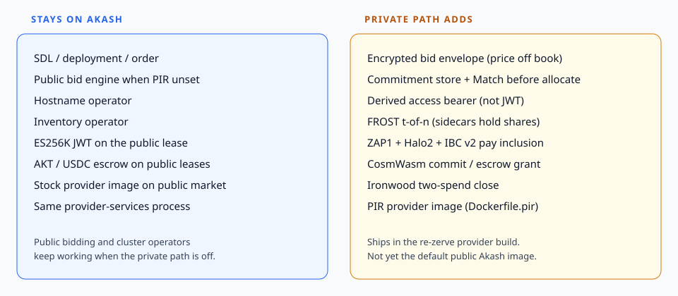

| Piece | Public Akash | Private path |
|---|---|---|
| SDL, deployment, order | Unchanged | Shared |
| Hostname and inventory operators | Unchanged | Unchanged |
| Bid engine, JWT, AKT escrow | Default when private path is off | — |
| Public provider image | Default for public leases | — |
| Sealed bid + commitment match | — | `pirgate` in this build |
| Derived bearer at the gateway | — | `gateway/pir` in this build |
| PIR-capable provider image | — | `Dockerfile.pir` in this repository |
| CosmWasm commit and escrow | — | `cw-pir-commit`, `cw-pir-escrow` |
| Pay inclusion | — | ZAP1 IBC v2 attestation + Halo2 |
| Provider as spend signer | — | FROST identifier 2; two shielded spends at close |

### Where each dependency sits

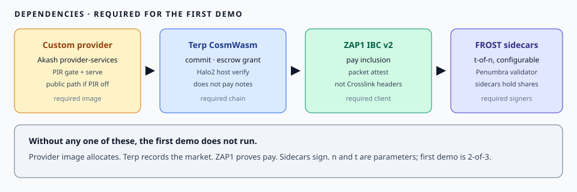

| Piece | Role | Relation to Akash |
|---|---|---|
| Provider image | Allocate, serve, stop | Same `provider-services` binary |
| CosmWasm VM | Commitments, proof verify, close grant | A record beside the order. It does not pay the notes. |
| ZAP1 IBC v2 | Pay inclusion | Packet attestation. Distinct from the Crosslink header client. |
| FROST holders | Spend authority | The provider is one of three signers |

A private lease:

1. Public deployment and order.
2. Sealed bid to the deployer.
3. Commitments on the public record.
4. Allocate after match.
5. Winner bearer opens the endpoint.
6. Close splits the shielded note: earned to the provider, remainder to the deployer.

Sealing, proofs, and spend math are in Specification.

## First demonstration

The first demonstration is three parts:

1. An **additional market on Terp Network** (commitments, match, pay inclusion).
2. **Threshold signers** are collaborative FROST sidecars. First-demo placement: one on an Akash lease, two in local Wasmer. Penumbra-style validator sidecars are a natural home for those shares.
3. **Providers run a custom Akash provider** (`provider-services` with the private gate) so market access **extends** the Supercloud.

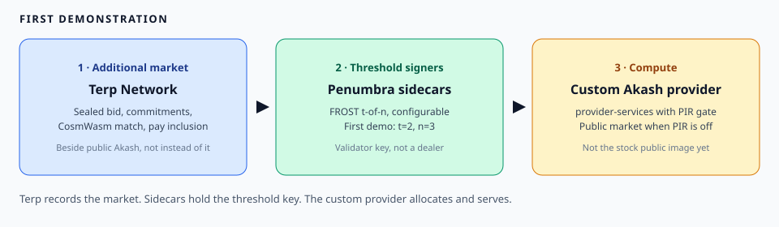

FROST `n` and `t` are parameters. The first demo uses **t = 2, n = 3**.

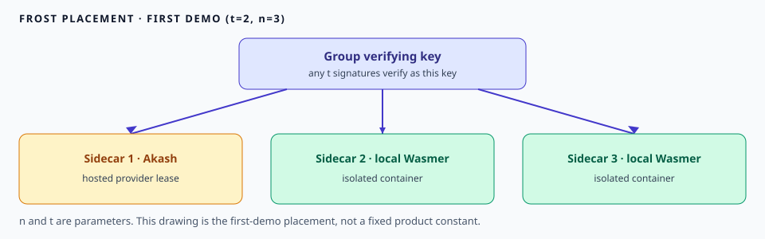

| Seat | Placement |
|---|---|
| 1 | Akash lease (custom provider) |
| 2 | Local isolated Wasmer container |
| 3 | Local isolated Wasmer container |

The demonstration checks that FROST signatures verify as the group key. Sidecar placement (Akash, isolated Wasmer, Penumbra-style validator sidecars) is how operators share the threshold.

## Requirements

| Requirement | Needed for |
|---|---|
| Custom `provider-services` image | Allocate / serve / stop; public path when PIR is off |
| Terp + CosmWasm (`cw-pir-commit`, `cw-pir-escrow`) | Additional market record |
| ZAP1 IBC v2 attestation | Pay inclusion |
| FROST-ed25519 DKG, no dealer | Threshold key |
| Isolated Wasmer runtime (×2) | Local sidecars |
| One Akash lease | Hosted sidecar |
| Halo2 host on the CosmWasm VM | Proof verify |

Missing any required surface, the path stops.

## Motivation

Public `MsgCreateBid` puts price on the order. Deployers shopping inference or GPU capacity, and providers quoting it, expose rate, identity, and often the leased endpoint on the same surface that the bid engine, hostname operator, and inventory operator already use for public leases.

That is the wrong default for a private rent:

1. **Price leakage.** A public bid is an auction transcript. Competing providers learn the winning rate. Deployers cannot request capacity without publishing a clearing price.
2. **Identity leakage.** The bid names the provider. The lease credential on the public path is an ES256K (secp256k1) JWT bound to the deployer account, which is the wrong secret for a privately matched lease.
3. **Settlement mismatch.** Akash escrow is AKT/USDC on chain. Product value for this market lives in Ironwood shielded notes whose spend authority is a FROST group. CosmWasm must not move that value with `BankMsg` or uterp. Crosslink headers are a different client; they are not pay inclusion.
4. **Split binaries.** A second provider image that *only* speaks the private path would force operators off the public marketplace. The public bid engine, hostname operator, and inventory operator must keep working when the private gate is off.

The existing protocol is adequate for a public Supercloud order book. It is not adequate when the bid must stay off that book while the same provider remains a public Akash provider. This AEP adds a fail-closed side-market for that case, without replacing SDL, deployments, orders, or public leases.

## Specification

Normative behavior below. Status: implemented in the crate and the `provider-services` lab fork; available in the local lab; not on the public network yet.

### Actors and Akash nouns

| Akash noun | Role in this AEP |
|---|---|
| Deployer | Creates the deployment. Public ask is the deployment/order. |
| Provider | Bids and allocates. Stays a public Akash provider. May hold a FROST seat. |
| Deployment / order | Public resource request (the public ask). |
| Bid | Encrypted envelope; price is not on the public order book. |
| Lease | Opened only after `Match`. Credential is the derived access bearer. |
| Escrow | CosmWasm records grant and events. Value is Ironwood notes, not bank coins. |
| Manifest / SDL | Carried on the public ask. |
| `provider-services` | Same binary for public market and private side-market. |
| Bid engine | Public `MsgCreateBid` when PIR env is unset; gated allocate when PIR mode is on. |
| Hostname operator, inventory operator | Unchanged public-path operators. |

### Public ask, envelope, commitments

Full field tables: [`data-structures.md`](data-structures.md) (`PublicAsk`, `EncryptedBidEnvelope`, `CommitmentStore`).

| Object | Public | Private |
|---|---|---|
| `PublicAsk` | SDL, resources, `ask_id` | — |
| `ask_commitment` | 64-char hex on chain | binds the ask |
| `EncryptedBidEnvelope` | — | ChaCha20-Poly1305, OOB |
| `bid_commitment` | 64-char hex on chain | hash of nonce ‖ ciphertext ‖ mac |
| `Match` | `{ matches: bool }` | allocate only if true |

Anyone may read the ask. Competing prices are not on that surface. Open with the wrong AEAD key MUST fail closed. `Match` is stored-hex equality; tampered bid hex MUST NOT match.

### Private information retrieval of bids and asks

A sealed envelope still has to *move*. Direct OOB (email, HTTPS to the provider, a shared inbox) lets the courier draw an **association graph**: who queried which `ask_id`, which provider, when. This AEP requires a PIR surface so that graph is not available to the courier.

| Role | Retrieves | From |
|---|---|---|
| Deployer (renter) | Sealed bid envelope(s) matching an ask | Bid index |
| Provider | Public ask row (and later match metadata) | Ask index |

The index MAY be served by an untrusted **provider proxy**. The proxy stores rows; it answers PIR queries. It MUST NOT learn the queried index. Design follows Valar Group PIR for retrieval (single-server YPIR / SimplePIR as in [vote-nullifier-pir](https://github.com/valargroup/vote-nullifier-pir) and [spendability-pir](https://github.com/valargroup/spendability-pir), crate [`valar-ypir`](https://crates.io/crates/valar-ypir)): database of fixed-size rows, client query hides the row, server returns an answer from which only the client recovers the envelope.

This is **not implemented** in `private-inference-rent` today. Direct OOB ChaCha delivery is the crate’s current path. Cryptographic PIR + the proxy are **upcoming deliverables** (see funding). Env names `PIR_MODE` / `PIR_REQUIRE_COMMIT` remain the side-market **gate**; they are not this retrieval scheme.

Field table: [`BidAskPir`](data-structures.md#bidaskpir-proposed).

### Allocate only after Match

`PirAllocationAllowed` in `provider-services`:

1. If PIR environment variables are **unset**, return true. The provider stays on the **public** Akash marketplace. The bid engine may still `MsgCreateBid`.
2. If `PIR_REQUIRE_COMMIT=1` or `PIR_MODE=1`, fail closed unless ask and bid commitments are 32-byte hex. Bid hex MAY be derived from `PIR_BID_ENVELOPE` / `PIR_BID_ENVELOPE_FILE` (`bid-commit-v1`). If both a bid-commit env/file and an envelope are present, they MUST agree.
3. If `PIR_REQUIRE_ENVELOPE=1`, fail closed unless a ChaCha envelope is present **and** `PIR_COMMIT_MATCH_URL` is set.
4. If `PIR_COMMIT_MATCH_URL` is set, POST `{"match":{ask_commitment,bid_commitment}}` (or CosmWasm LCD GET `/smart/{base64}`) and require `{matches:true}` (or LCD `{data:{matches:true}}`). Allocate only after that `Match`.
5. If `PIR_ZAP1_REQUIRE=1`, also require Halo2/ZAP1 accept JSON (`zap1_halo2_accepted` or `matches`). Missing host or false proof fails closed.
6. If the out-of-band ChaCha20-Poly1305 key is set (`PIR_SESSION_KEY`, 64-hex) with an envelope, Open MUST succeed. A loser key denies allocate.

No allocate, no lease container, no hostname binding for the private path, until those checks pass.

### Derived access bearer versus JWT

Public Akash lease logs, manifest, and status use an **ES256K** (secp256k1) JWT for the deployer account. That JWT is **not** the private-path lease credential.

After accept, the winner holds a `DerivedAccess` bearer ([table](data-structures.md#derivedaccess)). Gateway `AuthProcess` treats `Authorization: Bearer <64-hex>` as lease access. A foreign bearer is denied. After `pir stop` / close, the winner bearer is denied. Stock JWT and mTLS MAY still exist on the public cluster path; they are a different credential.

`provider-services pir accept --lease L --bearer <64-hex>` writes the lease book. `pir serve` runs the leased workload only for that bearer. `pir stop` removes it.

### FROST parameters

FROST is **not** a fixed 2-of-3 role map. Implementations MUST take:

| Parameter | Meaning |
|---|---|
| `n` (`max_signers`) | Number of sidecars that hold a share |
| `t` (`min_signers`) | Signatures required to verify as the group |
| Ciphersuite | RFC 9591 FROST-ed25519 in this draft |
| Identifiers | `1..=n` |
| Placement | Where each sidecar runs (Akash lease, Wasmer, other) |

Trusted-dealer keygen is not the product path. Key packages live on the seats. The group MUST NOT retain dealer shares.

**First-demo profile:** `t=2`, `n=3`. Placement is collaborative (one Akash lease, two isolated Wasmer). Penumbra-style validator sidecars MAY hold shares. Any two signatures MUST verify as the group key.

**Lease profile (crate today):** the same `(t, n)` with seats labeled deployer, provider, resolver for close grants. Happy-path sign is two of those three. A resolver share is used only after a recorded close grant. No viewing key on escrow.

Changing `n` or `t` is a configuration change, not a new market. The crate exposes `FrostParams` (`FIRST_DEMO` is `{ max_signers: 3, min_signers: 2 }`). Field table: [`FrostParams`](data-structures.md#frostparams).

### AKT stake inclusion (proposed)

Private market access SHOULD still **extend demand for AKT**. A bidder proves, in zero knowledge, `stake ≥ min_stake_uakt` against a staking-tree root (`AktStakeInclusion` in [`data-structures.md`](data-structures.md#aktstakeinclusion-proposed)). The bid does not publish the bonding account.

This proof is **not in the crate today**. It is a required direction of this AEP, not an optional slogan.

### Ironwood close spends

Value lives in **Ironwood** shielded notes (NU6.3, V3 plaintext, v6 tx) on Zakura. Not Orchard. Not Sapling. Not CosmWasm `BankMsg`. Not uterp.

Open: shield into an Ironwood note whose spend authority is the DKG group.

Close: two `add_ironwood_spend` of **that** opened DKG note:

1. First spend consumes the opened note: earned to the provider, remainder note back to the group.
2. Second spend consumes the remainder note to the deployer.

Earned is `f(open_height, close_height, rate) = (close_height - open_height) * rate` from Zcash heights between bid-accept and close. The closer MUST NOT supply earned as an integer. Public JSON carries commitments / circuit instances only — not plaintext hours, rate, or earned.

Spend grant is **`frost-spend-v1` over the opened Ironwood nullifier**, with Ironwood `SpendingKey` derived by **ZIP-32** (coin type 133) of the reconstructed DKG group seed. **ZIP-312 RedPallas FROST is not in Zakura.** That ZIP-32 stand-in is the honest production path in the crate; it is not a fake ZIP-312.

CosmWasm escrow emits **grant and events only**. It does not pay.

Pay inclusion for credit is a Halo2 proof that a `HOSTING_PAYMENT` leaf sits in the ZAP1 tree (public instances: merkle root, FROST group, amount class, payment kind — not Merkle siblings). **Crosslink is not ZAP1.** Crosslink headers are a different client and MUST NOT be treated as this pay path.

Stoffel secret-shared CMP is not this market.

### Public market default when PIR env unset

The private path is a dedicated side-market in the **same** `provider-services` binary.

When `PIR_REQUIRE_COMMIT`, `PIR_MODE`, and related PIR variables are unset:

- `PirAllocationAllowed` is true
- the bid engine follows public Akash bid/lease
- hostname operator and inventory operator are unchanged
- the provider remains on the public Akash marketplace

When PIR mode is on, the private path is **fail-closed**: missing envelope (if required), non-hex commitment, `Match=false`, failed Open, or missing ZAP1 accept (if required) MUST NOT allocate.

### Workflows

**Market shape.** Public order, sealed bid, commitments only on the record.

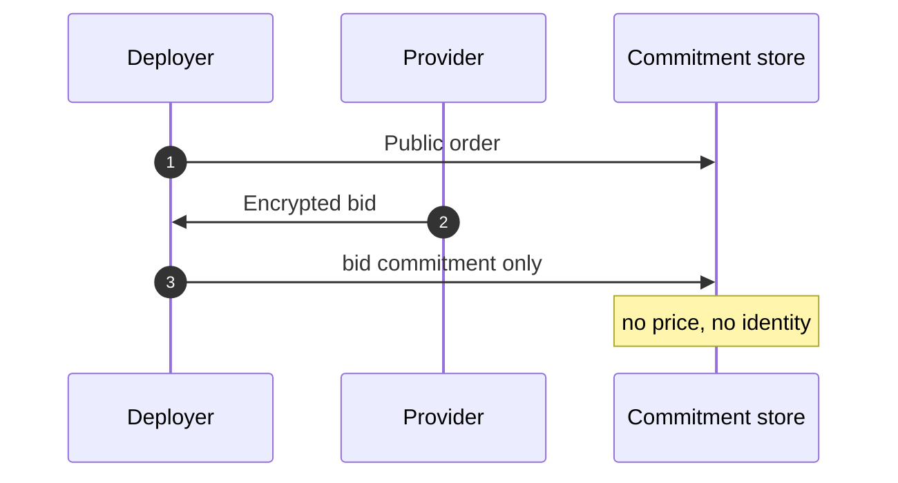

**Pay inclusion.** ZAP1 leaf + Halo2 + IBC v2 packet. Crosslink headers MUST NOT appear on this path.

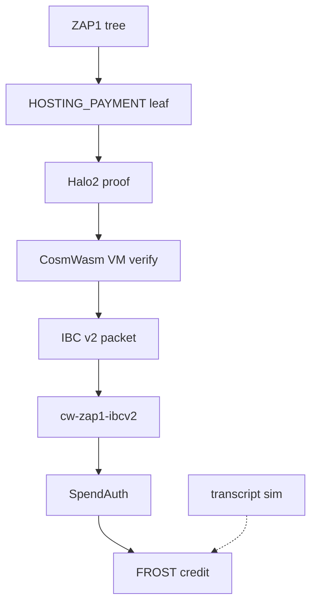

**FROST sidecars.** Configurable `t` of `n`. Collaborative placement. Dealer packages are not product custody.

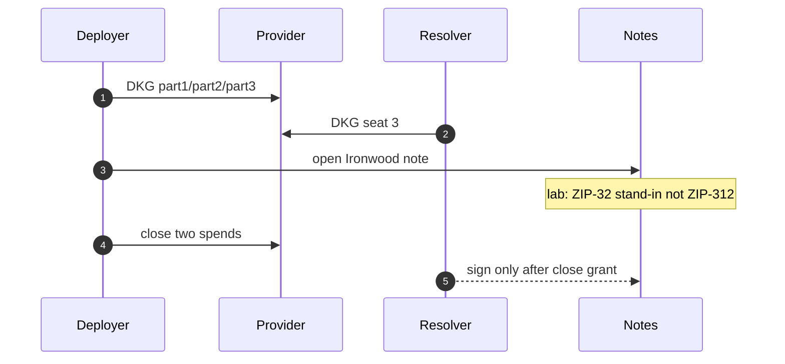

**Provider image.** Same binary. Stock image has no PIR path.

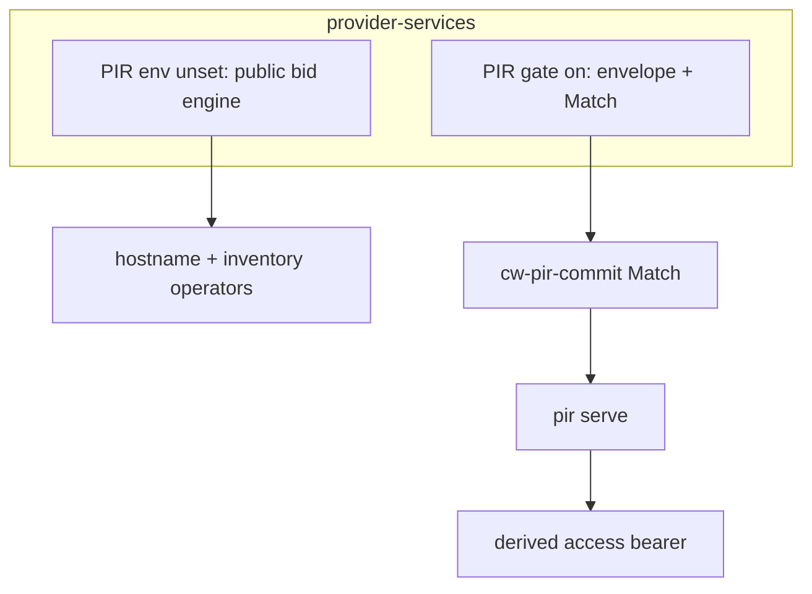

## Dependencies

Implementations MUST name these four surfaces. Omitting any of them implies a stack this AEP does not specify.

### ZAP1 IBC v2 light client

Pay inclusion is a `HOSTING_PAYMENT` event in a BLAKE2b ZAP1 tree plus an IBC **v2** packet attestation.

| Component | Role | MUST NOT be treated as |
|---|---|---|
| `zap1-verify` 0.2.1 | Builds the Merkle witness | On-chain execute |
| `cw-zap1-ibcv2` | CosmWasm attestation module (create / attest / `Match`) | Full ICS-08 nine-entrypoint 08-wasm host |
| `cw-ics08-wasm-zap1` | 08-wasm light-client crate in the Terp tree | The selected public IBC client |
| in-proc `pir-zap1-lc` | Lab helper | The light client |
| Crosslink 08-wasm | Header verification | ZAP1 pay inclusion |

Status: attestation module and local e2e store/attest/tamper-reject are implemented in the crate and available in the local lab. A live ICS-08 client selected on a public Terp network is **not on the public network yet**. RAM `packet_commitment` is not the light client.

### CosmWasm VM and Halo2

Contracts execute on a CosmWasm VM. The host verifies Halo2 via `proof_instance_verify` (`halo2_proofs::plonk::verify_proof`) against a pinned verifying key (Pasta / Vesta IPA, k=17, four public instances). Missing host MUST fail closed. Empty proof MUST fail. Merkle siblings MUST NOT be in the execute payload.

Circuit crate: `crate/circuits/hosting-payment` (`hosting-payment`). Pinned artifacts: `crate/artifacts/halo2/` (`vk_body.bin`, `params.bin`, `proof.bin`, `instances.bin`). Export: `pir-export-halo2`.

| Public instance (128 bytes LE) | Meaning |
|---|---|
| `[0]` | ZAP1 BLAKE2b merkle root (254-bit pack) |
| `[1]` | FROST group |
| `[2]` | amount class |
| `[3]` | `HOSTING_PAYMENT` domain |

Accrual circuit (same crate, `accrual` module): `f(open_height, close_height, rate)`, 96-byte instances.

| Contract | Package | Path |
|---|---|---|
| `cw-pir-commit` | `cw-pir-commit` | `crate/cw-commit/` |
| `cw-pir-escrow` | `cw-pir-escrow` | `crate/cw-escrow/` |
| `cw-zap1-ibcv2` | `cw-zap1-ibcv2` | `crate/cw-zap1-ibcv2/` |

Ironwood note spends happen off this VM. The VM records the close grant. Field tables: [`data-structures.md`](data-structures.md). Crate map: [`crate-map.md`](crate-map.md).

### FROST multisig sidecars

Spend authority is RFC 9591 FROST (`frost-ed25519`). `t` of `n` is `FrostParams` (`crate/src/frost_dkg.rs`). `pir-frost-holder` is one KeyPackage per OS process (stdin/stdout `COMMIT` / `SIGN`). Product custody MUST use `dkg_escrow_seats()` part1/part2/part3. `generate_with_dealer` on this path is a protocol error.

ZIP-312 RedPallas FROST is not in Zakura. Implementations MUST name the ZIP-32 reconstructed-seed stand-in.

### Provider image / PIR support

| Image | Role |
|---|---|
| `ghcr.io/akash-network/provider` | Stock public bid/lease. No PIR envelope path. Unchanged when this AEP is unused. |
| `akash-provider-pir:local` (`Dockerfile.pir`) | Lab fork. `pir sidecar`, `pir serve` sibling containers, docker.sock. |

The private path is the **same** `provider-services` binary with PIR env set. ict-rs `PIR_PROVIDER_IMAGE` selects the fork image. This AEP does **not** change the stock image on the public network and does **not** require a Kubernetes fleet. Public allocate MUST still succeed when PIR env is unset.

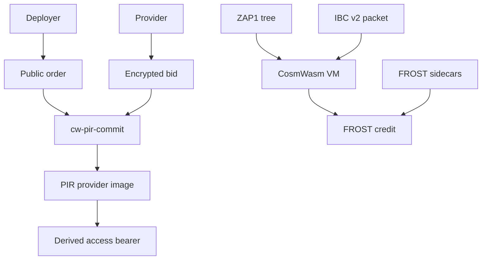

## Rationale

**Why not public `MsgCreateBid` only.** A public bid is the Akash order book. Price and identity on that book are the feature for the Supercloud auction. They are the bug for private inference rent. Commitments plus an out-of-band ChaCha envelope keep the auction binding without publishing the quote.

**Why a side-market in the same binary, not a second daemon.** Operators already run `provider-services`, the bid engine, the hostname operator, and the inventory operator. A second binary would strand public inventory. Env-gated, fail-closed private checks let one image serve both. Unset PIR env is the public default so a stock-configured process does not silently require commitments.

**Why allocate only after `Match`.** Local hex files can be forged. The CosmWasm `Match` query is the on-chain binding that the ask and bid commitments were posted. Envelope-derived bid hex that disagrees with stored hex must not allocate.

**Why a derived bearer, not ES256K JWT.** The public JWT authenticates the deployer account to the public gateway. The private lease must open only for the winner of a specific sealed bid. Deriving the bearer from the out-of-band AEAD key, the bid commitment, and the ask id binds access to that envelope. Loser keys cannot mint it. Elevating that secret to JWT/mTLS later is out of scope for this draft; the lease credential specified here is the hex bearer.

**Why FROST is collaboration.** Spend authority is a DKG group with configurable `t` of `n`. Sidecars can live on Akash, in Wasmer, or as Penumbra-style validator sidecars — stacks that already isolate signer processes. Sharing a threshold with those operators is the point.

**Why AKT inclusion.** Sealed bids must not drain demand from AKT. A ZK proof that the bidder holds a minimum stake keeps buy-and-hold pressure on AKT without putting the bonding account on the order book.

**Why cryptographic PIR.** A sealed envelope still has to move. Whoever hosts the inbox sees who asked for which bid. PIR lets a renter fetch a row without the **provider proxy** learning the index, so that association graph is not a product of the market. Valar Group PIR is the retrieval design to follow.

**Why Ironwood two-spend close, ZIP-32 named.** Product money is shielded Zcash, not uterp. Two spends (earned, remainder) match the lease split. ZIP-312 RedPallas is not implemented in Zakura; naming the ZIP-32 reconstructed-seed stand-in keeps the spend honest instead of claiming a RedPallas FROST spend that does not exist.

**Alternatives rejected.**

- AES-GCM or JWT-wrapped bids — not the crate AEAD; ChaCha20-Poly1305 is the envelope.
- Dealer FROST (`generate_with_dealer`) as product custody — forbidden on this path.
- Viewing keys for the resolver — forbidden; grant-gated share only.
- Crosslink as pay inclusion — different client; ZAP1 + Halo2 is the pay proof.
- Dummy STARK / always-true verify — fail closed if the host is missing.

## Backward Compatibility

This AEP introduces **no** consensus change to public Akash deployment, order, bid, or lease messages when PIR environment variables are unset.

| Surface | Compatibility |
|---|---|
| Public `MsgCreateBid` / lease | Unchanged default. |
| SDL, manifest, hostname operator, inventory operator | Unchanged. |
| Stock `ghcr.io/akash-network/provider` | Unchanged. The private path is a lab fork of `provider-services`, not the stock image on the public network. |
| ES256K JWT | Still the public lease credential. The derived bearer is additional and private-path only. |
| PIR mode on | Fail-closed side-market. Public allocate without commitments is refused *only* in that mode. |

Severity of incompatibility if PIR mode is enabled on a provider that intended to be public-only: private allocate will deny until commitments/`Match` are present. Mitigation: leave PIR env unset.

This draft does not require an Akash consensus fork to experiment in the local lab. A future numbered AEP, if the Akash editor accepts one, would specify any consensus or `provider-services` upstream change. This file is not that submission.

## Test Cases

Tests in this repository run the sequence locally. They do not require the public Akash network.

Crate (Rust), available in the local lab:

- `tests/ask_bid.rs` — public ask with SDL/resources; ChaCha round-trip; tampered ciphertext fails MAC; on-chain view is commitments only.
- `tests/access_derive.rs` — winner bearer stable; loser denied; close denies the winner.
- `tests/frost_dkg.rs`, `tests/frost_seats.rs` — identifiers 1/2/3; `t=2`; one seat fails; deployer+provider sign.
- `tests/zcash_escrow.rs`, `tests/escrow_close.rs` — Ironwood open; two close spends; ZIP-32 stand-in named; ZIP-312 not claimed.
- `tests/accrual.rs` / product accrual path — `f(open_height, close_height, rate)`; closer cannot set earned.
- `tests/e2e_local.rs` — local chain sequence for ask, commit, match, accept, bearer, close.

Provider fork (Go):

- `pirgate/gate_test.go` — unset PIR env still allocates (public market default); `PIR_REQUIRE_COMMIT=1` without hex denies; `Match` true allocates; tampered bid hex does not; envelope + `Match` required together when `PIR_REQUIRE_ENVELOPE=1`.
- `gateway/pir/access_test.go` — derived bearer accepted; foreign bearer denied; stop denies.

Required outcomes:

1. Public allocate succeeds when PIR env is unset.
2. Private path fail-closed: no envelope / no `Match` / loser AEAD key → no allocate.
3. Gateway: winner bearer only, then deny after close.
4. Close: two Ironwood spends; CosmWasm grant only; no `BankMsg`.

## Implementations

The **`private-inference-rent`** crate (`crate/`) and the `provider-services` fork (`provider/`) implement the private path. Draft. The public Akash provider image does not include it.

| Surface | In this repo |
|---|---|
| Ask / bid / bearer | `crate/src/ask.rs`, `bid.rs`, `access.rs` |
| Halo2 HOSTING_PAYMENT + accrual | `crate/circuits/hosting-payment` |
| Halo2 VK / params | `crate/artifacts/halo2/` |
| `cw-pir-commit` | `crate/cw-commit/` |
| `cw-pir-escrow` | `crate/cw-escrow/` |
| `cw-zap1-ibcv2` | `crate/cw-zap1-ibcv2/` |
| FROST DKG | `crate/src/frost_dkg.rs`, `pir-frost-holder` |
| PIR gate / bearer | `provider/pirgate/`, `provider/gateway/pir/` |

Full table: [`crate-map.md`](crate-map.md).

## Security Considerations

**Envelope AEAD.** ChaCha20-Poly1305 with AAD over ask id and nonce. Wrong key and truncated envelopes fail closed. Nonce reuse with the same out-of-band AEAD key breaks confidentiality of that envelope; implementations MUST use a fresh nonce per seal.

**PIR retrieval.** A provider proxy MUST NOT learn which bid or ask row a client fetched. Direct OOB without PIR publishes an association graph; that is not the product path once the PIR dependency ships. Server-side logging of PIR queries by index is forbidden.

**Commitment-only public record.** The commitment store MUST reject non-hex and MUST NOT store price, bidder identity, endpoint, or the envelope. `Match` is equality of stored hex, not a proof of plaintext.

**Bearer derivation.** The derived access bearer is a capability for the winning lease. Logs MUST NOT record the out-of-band AEAD key, envelope plaintext, raw bearer, or derivation inputs. Log ask id, commitment hex, and allocate/deny only. Bearer replay after close MUST fail.

**Not the public JWT.** Accepting an ES256K deployer JWT as the private lease credential would let the account holder, not the envelope winner, open the endpoint. The public JWT remains for public leases only.

**FROST threshold.** Fewer than `t` seats MUST NOT spend. Dealer leftovers on the group are a protocol error. On the lease profile, a resolver share without a recorded grant is denied. No viewing key on escrow.

**Ironwood spends.** Spend the opened DKG note, not miner coinbase, not a cloned provider transaction as a fake refund. ZIP-312 RedPallas is not in Zakura; implementations MUST name the ZIP-32 reconstructed-seed stand-in and MUST NOT claim RedPallas FROST ownership.

**Accrual.** Closer-supplied earned is forbidden. Heights come from the Zcash chain the deposit is on. Wall-clock is not block time.

**Pay path.** Halo2 verify against a pinned VK. False proof or missing host fails closed. Crosslink MUST NOT be treated as ZAP1 pay inclusion.

**Fail closed.** When PIR mode is required, missing match URL, missing envelope, or failed Open is a deny, not a public-path fallback. Public fallback exists only when PIR env is unset.

**Side-market isolation.** Private allocate MUST NOT weaken public bid-engine, hostname-operator, or inventory-operator checks on the public path.

## References

- [Akash core concepts](https://akash.network/docs/getting-started/core-concepts/) — deployer, provider, deployment, order, bid, lease, escrow.
- [Akash SDL](https://akash.network/docs/developers/deployment/akash-sdl/) — Stack Definition Language on the public ask.
- [RFC 8439, ChaCha20-Poly1305](https://datatracker.ietf.org/doc/html/rfc8439) — bid envelope AEAD.
- [RFC 9591, FROST](https://www.rfc-editor.org/rfc/rfc9591.html) — threshold signatures; `t` and `n` are parameters.
- [ZIP 32](https://zips.z.cash/zip-0032) — named Ironwood spend stand-in. ZIP-312 RedPallas is not in Zakura.
- [ZIP 258, NU6.3 / Ironwood](https://zips.z.cash/zip-0258) — shielded value is Ironwood notes, not bank coins.
- [Halo](https://eprint.iacr.org/2019/1021) — recursive proof composition.
- [Halo2 book](https://zcash.github.io/halo2/) — PLONK arithmetization used by `hosting-payment`.
- [Pasta curves](https://electriccoin.co/blog/the-pasta-curves-for-halo-2-and-beyond/) — Pallas/Vesta; this circuit uses Vesta IPA, k=17.
- `halo2_proofs::plonk::verify_proof` — host `proof_instance_verify`; empty proof fails.
- Crate `private-inference-rent` (`crate/`), circuit `crate/circuits/hosting-payment`, contracts `crate/cw-commit`, `crate/cw-escrow`, `crate/cw-zap1-ibcv2`. Map: [`crate-map.md`](crate-map.md).
- [YPIR](https://www.usenix.org/conference/usenixsecurity24/presentation/menon) (Menon, Wu, USENIX Security 2024) — single-server PIR with silent preprocessing.
- [valar-ypir](https://crates.io/crates/valar-ypir) / [vote-nullifier-pir](https://github.com/valargroup/vote-nullifier-pir) / [spendability-pir](https://github.com/valargroup/spendability-pir) — Valar Group PIR to mirror for bid/ask retrieval.

## Open questions, committee, and funding

This subsection is for the Akash community. The three biases in **Thesis** are the ones to keep or reject.

### Clarity

1. Does **extending Akash market access** (same `provider-services`, public path default) stay the goal, or is a separate private-only image acceptable?
2. Is a **ZK inclusion proof of minimum AKT stake** a gate on sealed bids? If yes, what `min_stake_uakt`, which staking tree, which height?
3. FROST seats as a **cross-chain collaborative opportunity**, including Penumbra-style validator sidecars.
4. PIR for bid/ask retrieval: which Valar-group scheme (YPIR vs SimplePIR vs two-tier) and who may run a **provider proxy**?
5. Commitments on Terp vs on Akash itself?
6. Private gate in-tree in `provider-services`, or a configured fork forever?
7. What `(n, t)` bounds freeze vs operator configuration?

### Improvements (funding surface)

| Area | Why it is on the grant, not a slogan |
|---|---|
| Circuit / proof optimizations | Halo2 k=17 prove is long. Smaller vk, faster `proof_instance_verify`, AKT-inclusion circuit when it exists. |
| Light-client interop | `cw-zap1-ibcv2` is attestation, not a selected ICS-08 client. Extend LC interop so pay inclusion is a real client, not a lab module. |
| Contracts on a non-Terp CosmWasm | Curate `cw-pir-commit` / `cw-pir-escrow` / `cw-zap1-ibcv2` against stock CosmWasm so the market is not a Terp-only fork. |
| Benchmarks, tests, front end | Allocate/match/close latency; e2e that includes AKT inclusion; a deployer/provider UI that does not dump AEAD. |
| Cryptographic PIR (bid/ask) | Valar-group-style retrieval so renters fetch sealed bids without the courier learning which row. |
| Provider proxy | Curate an untrusted third-party proxy that hosts the PIR index. Association graph stays off the proxy. |

### Roadmap (to decide, not a promise)

| Stage | Intent |
|---|---|
| First demo | Terp additional market + custom provider + 2-of-3 collaborative sidecars (Akash, Wasmer, Penumbra-style). FROST verify. |
| AKT inclusion | Specify and prove `AktStakeInclusion`. Sealed bid requires min AKT stake. |
| Parameterize FROST | Operators set `n` and `t`. |
| CosmWasm portability | Same contracts on a non-Terp CosmWasm. |
| LC interop | Selected IBC client, not only attestation. |
| Cryptographic PIR | Bid/ask index retrievable without revealing the query. Mirror Valar Group PIR. |
| Provider proxy | Untrusted courier for that index. |
| Upstream | Whether the side-market gate lands in `akash-network/provider`. |

### Decisions for an Akash committee

- Whether sealed bids **extend** the public marketplace or split it.
- Whether **minimum AKT stake (ZK)** is in scope as buy-and-hold pressure.
- That FROST is an invitation to collaborate, including Penumbra-style sidecars.
- That bid/ask **PIR** (private information retrieval) plus an untrusted **provider proxy** is in scope, following Valar Group PIR.
- SDL / order fields vs Terp-held commitments.
- Informational (experiment) vs Standard (protocol).

### Request for research funding

Experiment: extend Akash market access, keep AKT demand via stake inclusion, use FROST as cross-chain collaboration including Penumbra-style sidecars, and retrieve sealed bids by **private information retrieval** through an untrusted provider proxy.

Funding would support:

- First demo (custom provider, Terp market, collaborative sidecars, FROST verify).
- Spec + circuit for **AKT minimum-stake inclusion**.
- **Cryptographic PIR** for bid/ask retrieval, leveraging Valar Group PIR (YPIR / SimplePIR as in vote-nullifier and spendability).
- Curation of a **provider proxy** that can host that index without learning which row a renter or provider fetched.
- Circuit / proof optimizations (prove time, vk size, host verify).
- Light-client interop beyond the attestation module.
- Porting contracts to a **non-Terp CosmWasm**.
- Benchmarks, tests, and a minimal front end.
- Independent review of the sealed-bid gate, bearer, sidecar isolation, and PIR query privacy.

Scoped to that work and this AEP. Not a claim that public Akash already runs this path.

## Copyright

All content herein is licensed under [Apache 2.0](https://www.apache.org/licenses/LICENSE-2.0).
